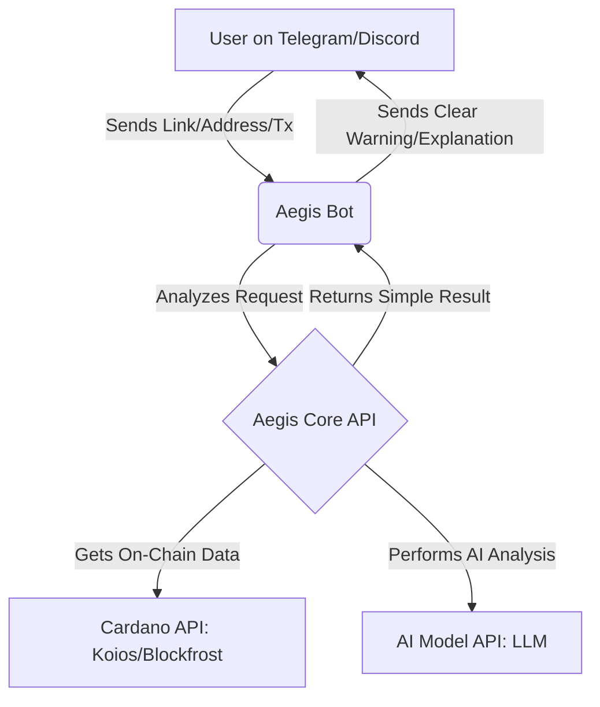

```markdown
# Aegis: Your AI Security Guardian for Cardano

**Project Status:** Community-Funded in Project Catalyst Fund14 | In Active Development

Aegis is an open-source project building an AI-powered security assistant to help users and developers identify scams, understand transactions, and protect their assets on the Cardano blockchain. Our goal is to make the Cardano ecosystem the safest place to operate in Web3.

**Official Website:** [aegis-cardano.vercel.app](https://aegis-cardano.vercel.app)  
**Catalyst Proposal:** [View Our Proposal](https://example.com)

---

## Connect With Us

- **X (Twitter):** [@aegiscardano](https://twitter.com/aegiscardano)
- **Telegram:** [Aegis Cardano Community](https://t.me/aegiscardano)
- **YouTube:** [Bana Codes Channel](https://youtube.com/@Banacodes)

---

## The Problem

The fear of scams is a major barrier to mass adoption. As the Cardano ecosystem grows, users are increasingly exposed to sophisticated phishing attacks, malicious dApps, and confusing transactions designed to drain their wallets. This creates a climate of fear that slows down growth and hurts user trust.

---

## Our Solution

Aegis provides a **free, intelligent, and easy-to-use security layer for everyone**. We are developing an **open-source security API** that any Cardano developer can integrate into their applications.

To demonstrate its power and provide immediate value, we're also building a **free public Telegram and Discord bot** that offers:

- **AI Link Scanner:** Analyzes websites for signs of phishing or wallet drainers.
- **Address Reputation Check:** Scans wallet addresses for suspicious on-chain activity.
- **Asset Authenticity Verification:** Confirms if an NFT or token is genuine by checking its Policy ID.
- **Plain-Language Transaction Explainer:** Translates complex transaction data into a simple, human-readable summary before you sign.

---

## How Aegis Works



---

Bot Commands (Planned Features)

Here's a preview of how you'll interact with the Aegis guardian bot once it's live:

Check a Wallet Address:

```plaintext
/check_address addr1q8...
```

> Aegis Reply: ⚠️ Caution! This address was created 3 hours ago and has interacted with a known scam contract.

Scan a Link:

```plaintext
/scan_link https://suspicious-minswap.io
```

> Aegis Reply: 🚨 High Risk! This website appears to be a phishing site impersonating Minswap. Do not connect your wallet.

Explain a Transaction:
(User pastes a raw transaction hex)  

> Aegis Reply: In simple terms, this transaction will: Send 50 ADA to an unknown wallet and give a smart contract permission to spend ALL of your SpaceBudz NFTs.

---

Project Vision

Our vision is to build a foundational trust layer for Cardano. By providing developers with a powerful, open-source security toolkit, we can collectively make the entire ecosystem safer, encouraging new users to join with confidence and empowering developers to build more secure applications.

---

Roadmap (6 Months)

Phase 1 (Months 1–3):
- Set up public GitHub repository with MIT License.
- Develop core bot framework for Telegram and Discord.
- Integrate with Cardano blockchain APIs (Blockfrost/Koios).
- Launch initial features: Address Reputation & Asset Authenticity.

Phase 2 (Months 4–6):
- Integrate AI model for the Link Scanner feature.
- Develop and test the Plain-Language Transaction Explainer.
- Publish comprehensive API documentation for developers.
- Launch public beta and gather community feedback.

---

Development Philosophy

Aegis is built using a modern, AI-augmented development philosophy. By pairing an experienced developer's intuition with advanced AI coding agents, we can achieve rapid, secure, and robust development. This human-AI collaborative approach allows us to focus on high-level security architecture while ensuring the code quality remains exceptionally high.

---

Get Involved

This project is for the community, by the community. If you believe in a safer Cardano, we ask for your vote in Project Catalyst Fund14. Development is now underway thanks to the support of the community.

- Follow our Progress: Star and watch this repository for updates.
- Contribute: We welcome contributions! Please check the open issues or submit a pull request.
- Vote: Your vote in Fund14 helps ensure the continued development and success of this project.

```
